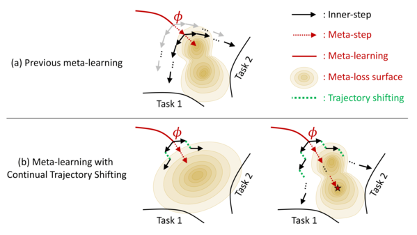

# Large-Scale Meta-Learning with Continual Trajectory Shifting

By **Jaewoong Shin, Hae Beom Lee, Boqing Gong, Sung Ju Hwang**

*Proceedings of the 38th International Conference on Machine Learning*, PMLR 139:9603-9613, 2021.

## Link

[PMLR](http://proceedings.mlr.press/v139/shin21a.html)
[Paper](http://proceedings.mlr.press/v139/shin21a.pdf)
[Slide](figs/LSML_slide.pdf)
[poster](figs/LSML_poster.png)

## Abstract



Meta-learning of shared initialization parameters has shown to be highly effective in solving few-shot learning tasks. However, extending the framework to many-shot scenarios, which may further enhance its practicality, has been relatively overlooked due to the technical difficulties of meta-learning over long chains of inner-gradient steps. In this paper, we first show that allowing the meta-learners to take a larger number of inner gradient steps better captures the structure of heterogeneous and large-scale task distributions, thus results in obtaining better initialization points. Further, in order to increase the frequency of meta-updates even with the excessively long inner-optimization trajectories, we propose to estimate the required shift of the task-specific parameters with respect to the change of the initialization parameters. By doing so, we can arbitrarily increase the frequency of meta-updates and thus greatly improve the meta-level convergence as well as the quality of the learned initializations. We validate our method on a heterogeneous set of large-scale tasks, and show that the algorithm largely outperforms the previous first-order meta-learning methods in terms of both generalization performance and convergence, as well as multi-task learning and fine-tuning baselines.

### Contribution of this work

- We show that large-scale meta-learning requires substantially a larger number of inner gradient steps than what are reqruied for few-shot learning.
- We show that gradually extending the length of inner learning trajectories lowers the risk of converging to poor meta-level local optima.
- To this end, we propose a novel and an efficient algorithm for large-scale meta-learning that frequently performs meta-optimization even with excessively long inner-learning trajectories.
- We verify our algorithm on a heterogeneous set of tasks, on which it achieves significant improvements over existing meta-learning algorithms in terms of meta-convergence and generalization performance.

## Prerequisites

…

## Run

### Meta training

```bash
  python meta_train_ours.py \
      --batch_size 128 \
      --train_steps 200000 \
      --opt sgd \
      --lr 1e-2 \
      --weight_decay 5e-4 \
      --no_nesterov\
      --momentum 0.9 \
      --meta_lr 1e-2 \
      --aggregate_period 1 \
      --reset_period 1000 \
      --no_hard_reset \
      --code_dir code \
      --save_dir checkpoints \
      --exp_name exp \
      --print_every 500 \
      --save_every 5000 \
      --gpus 0,1,2,3 \
      --port 123456 \
      --num_workers 1
```

### Meta testing

```bash
  python train_tgt.py \
      --batch_size 128 \
      --train_steps 1000 \
      --lr_schedule step_lr \
      --opt adam \
      --lr 1e-3 \
      --weight_decay 5e-4 \
      --nesterov \
      --momentum 0.9 \
      --meta_lr 1e-2 \
      --img_size 32 \
      --data stl10 \
      --code_dir code \
      --save_dir checkpoints \
      --src_name src_name \
      --src_steps 200000 \
      --exp_name exp \
      --print_every 200 \
      --save_every 1000 \
      --gpus 0 \
      --num_workers 3
```

## Citation

```text
@InProceedings{pmlr-v139-shin21a,
  title = {Large-Scale Meta-Learning with Continual Trajectory Shifting},
  author = {Shin, Jaewoong and Lee, Hae Beom and Gong, Boqing and Hwang, Sung Ju},
  booktitle = {Proceedings of the 38th International Conference on Machine Learning},
  pages = {9603--9613},
  year = {2021},
  editor = {Meila, Marina and Zhang, Tong},
  volume = {139},
  series = {Proceedings of Machine Learning Research},
  month = {18--24 Jul},
  publisher = {PMLR},
  pdf = {http://proceedings.mlr.press/v139/shin21a/shin21a.pdf},
  url = {http://proceedings.mlr.press/v139/shin21a.html},
  abstract = {Meta-learning of shared initialization parameters has shown to be highly effective in solving few-shot learning tasks. However, extending the framework to many-shot scenarios, which may further enhance its practicality, has been relatively overlooked due to the technical difficulties of meta-learning over long chains of inner-gradient steps. In this paper, we first show that allowing the meta-learners to take a larger number of inner gradient steps better captures the structure of heterogeneous and large-scale task distributions, thus results in obtaining better initialization points. Further, in order to increase the frequency of meta-updates even with the excessively long inner-optimization trajectories, we propose to estimate the required shift of the task-specific parameters with respect to the change of the initialization parameters. By doing so, we can arbitrarily increase the frequency of meta-updates and thus greatly improve the meta-level convergence as well as the quality of the learned initializations. We validate our method on a heterogeneous set of large-scale tasks, and show that the algorithm largely outperforms the previous first-order meta-learning methods in terms of both generalization performance and convergence, as well as multi-task learning and fine-tuning baselines.}
}
```
